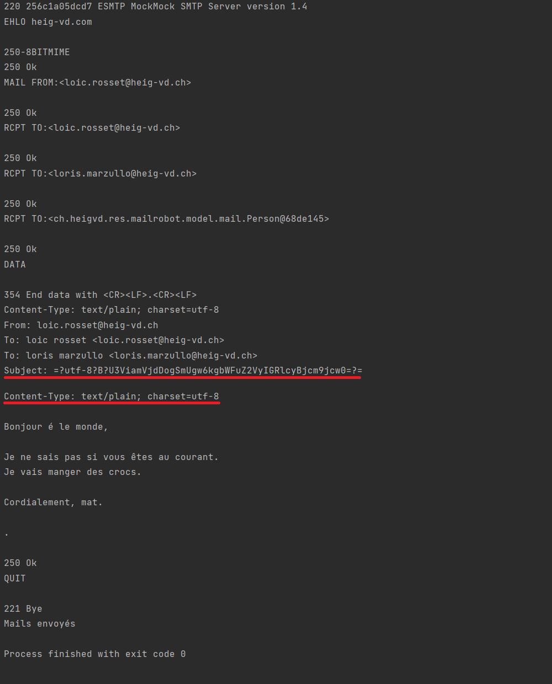
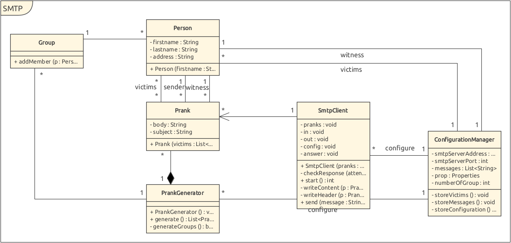

# Rapport labo smtp

## Description
Ce projet met à disposition un programme de "Prank" permettant d'envoyer des emails forgés via à un serveur mail MockMock à des groupes d'utilisateurs. 

## Installation d'un serveur MockMock via Docker
Après avoir installé Docker, il faut lancer un terminal de commande, puis se déplacer dans le dossier DockerConfiguration se trouvant dans ce repo. Ensuite, il faut effectuer la commande **"docker build ."** afin que Docker interprète le fichier dockerFile présent dans le but de créer une image.

Un container Docker ayant un serveur MockMock intallé sera ensuite disponible. Pour le lancer, il faut executer la commande **"docker run -p 8282:8282 -id du container-"**. Grâce au paramètre -p, on indique à Docker que l'on veut mapper le port 8282 de la machine sur le port 8282 du container. Ce port est indispensable car MockMock y fait tourner une interface web qui affiche les pranks créés par notre programme.

L'id de votre container peut être récupéré via la commande **"docker images"**.

## Utilisation
Pour utiliser le programme, il suffit juste de modifier les données dans les différents fichiers contenus dans le dossier ressources. Dans le fichier **"config.properties"**, on spécifie le port, l'adresse du serveur smtp, le nombre de groupes ainsi qu'un témoin. Le témoin étant une personne qui sera ajoutée en copie de chaque mail envoyé, afin de vérifier que l'envoi a bel et bien été fait. Il ne peut y avoir qu'un seul témoin.

Le fichier "victimes.utf8" contient toutes les personnes qui recevront un mail. Les victimes seront ensuite séparées en différents groupes selon le nombre de groupes spécifié dans le dossier config. La première personne de chaque groupe est désignée comme "sender". Ca sera donc de ladite personne que les mails auront l'air d'être envoyés.

Le fichier "messages.utf8" contient les différent messages envoyés dans le mail ainsi que le sujet. Le sujet du mail doit être en première ligne. Un message sera assigné aléatoirement à chaque groupe lors de la création des pranks.

## Choix d'implémentation
On a choisi de séparer le programme en 3 parties. Une partie s'occupant de la récupération des données, une générant les pranks à partir desdites données et la dernière faisant la connexion au serveur et envoyant les différents mails. La classe "MailRobot" est la classe gérant le programme. 

## Configuration des données
Le programme récupère ses informations de 3 fichiers :

- victims.utf8 qui liste les adresses emails utilisées pour l'émetteur et les réceptionneurs des pranks. Les adresses sont formatées pour créer des personnes et donc doivent se formater de la manière suivante : prénom.nom@...
- messages.utf8 qui stockent le contenu des messages qui sont ensuite envoyés. Il faut indiquer pour chaque message en première ligne le sujet du message sous cette forme : Subject : ...
Il faut aussi séparer les différents messages par la suite de caractères "==".
- configure.properties contenant les informations relatives au serveur mail et au témoin qui est ajouté en copie.

Le ConfigurationManager va ainsi lire ces fichiers et formater leur contenu pour l'utiliser dans le reste du programme.

## Pranks
Avant tout, une vérification du nombre de victimes est faite. Il doit y avoir au minimum 3 victimes par groupes. Dans le cas où le nombre de victimes n'est pas un multiple du nombre de groupes, les n premiers groupes créés auront une victime de plus (n correspondant au nombre de victimes modulo le nombre de groupes).

Une fois les groupes créés, un message aléatoirement selectionné leur est assigné et la première personne du groupe est désignée comme sender.

## Connexion au serveur et envoi des messages
A l'appel de la méthode "start", le client va tenter de se connecter au serveur. Une fois la connexion établie et la réponse initiale du serveur reçue, le client va commencer à envoyer des messages selon le protocole SMTP. Chacune des réponses du serveur sont vérifiées afin de voir si elles correspondent aux réponses attendues où s'il y a eu un problème. Si il y a eu un problème, le serveur log l'erreur et envoi "QUIT" au serveur, mettant ainsi fin à la connexion. S'il n'y a pas d'erreur, le serveur envoi la première personne des victimes en tant qu'envoyeur, chacune des victimes en tant que récepteur et envoi ensuite le corps du message. Après avoir terminé le mail en envoyant "CRLF.CRLF", le programme passe au groupe suivant ou envoi QUIT pour terminer la connexion s'il n'y a pas d'autres groupes.

Au niveau du header, la personne désignée en tant que "witness" n'apparaitra pas dans la liste des personnes recevant le mail. Etant donné qu'elle est la pour vérfier que le mail soit bien envoyé, elle ne doit pas être affichée parmi les victimes.

Le sujet du mail ainsi que le contenu sont encodés en UTF-8 afin de pouvoir écrire des accents.

Dans la capture d'écran ci-dessous, les lignes pointées sont des lignes permettant de spécifié que le contenu à bien été encodé en UTF-8.

## Exemple de communication

## Diagramme de classe
